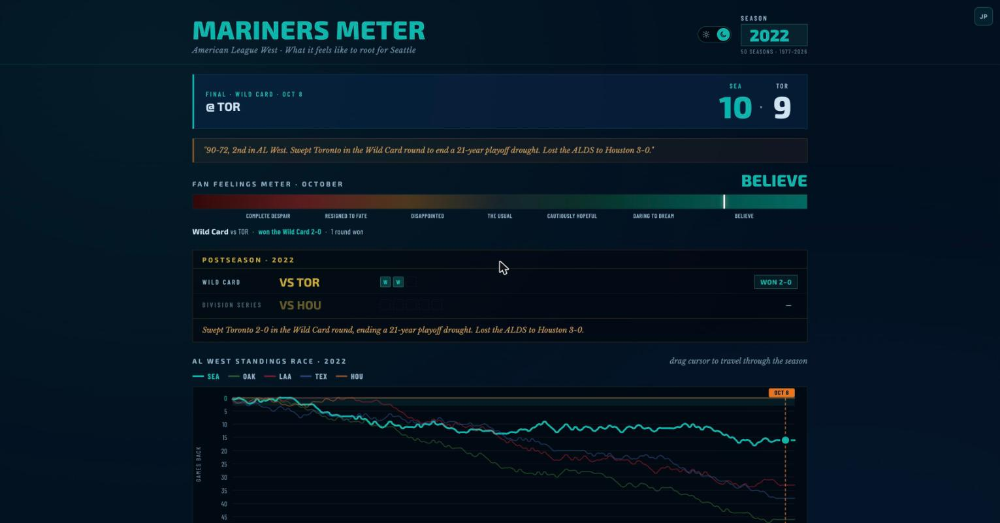

# Mariners Meter

A Seattle Mariners fan dashboard tracking the AL West standings race — any day, any season, all 50 years since 1977. Drag the cursor through any season and watch the standings, game results, playoff bracket, and fan mood meter update in real time.

**[View it live →](https://jeremyperonto.com/MarinersMeter/)** &nbsp;·&nbsp; **[Make one for your team →](#make-one-for-your-team)**

[](https://jeremyperonto.com/MarinersMeter/)

---

## What it does

- **Every season since 1977** — the full franchise, expansion year to today. 41,521 games in the database.
- **AL West standings chart** — smooth Catmull-Rom curves tracking games back over an entire season
- **Draggable time cursor** — scrub through any date in any season; the game card, standings table, and season record all update live
- **Fan Feelings Meter** — a mood score from win percentage, games back, recent form, streak, and playoff outcome, with a second needle showing the expected record from run differential
- **An October register** — scrub into the postseason and the meter switches to series state: up 2–0, facing elimination, won the round
- **Game card** — shows the result (or upcoming time) for every regular season and postseason game on the cursor date
- **Postseason panel** — series-by-series results that fill in as the cursor passes each game
- **Season lore** — a factual defining moment or milestone for notable years
- **Live game polling** — when today's game is in progress, scores update every 20 seconds via the MLB Stats API
- **Day and night themes** — follows your system setting, with a switch in the header. [How it works](#themes)

---

## About & suggest an improvement (on the page)

The live page has an **About & suggest an improvement** link in the footer. The modal covers where the data comes from (and which half took work), defines the Pythagorean math behind the meter's "Expected" needle, and links "Make one for your team" (below).

It also takes bug reports and feature requests three ways: a prefilled GitHub issue, a prompt you can paste into your own AI, or email to jeremy@peronto.com. The copy buttons fall back to `execCommand` and then to selecting the text if the browser blocks clipboard access, so they never fail silently.

---

## Stack

This is a single self-contained HTML file. No build step, no npm, no framework installation.

| Layer | Choice | Why |
|---|---|---|
| UI | React 18 + Babel (CDN) | No build toolchain, deploys as a static file |
| Data | MLB Stats API (unauthenticated) | Free, reliable, covers 2005–present |
| History | Retrosheet game logs | Covers 1977–2004, where the MLB API stops |
| Storage | Supabase (Postgres) | One-time ingestion of both sources; nightly refresh for current season |
| Hosting | GitHub Pages | Free static hosting, deploys on push |
| Fonts | Exo 2, Barlow Condensed, Libre Baskerville (Google Fonts) | Sporty display + readable body + italic flavor text |
| Theming | CSS custom properties on `<html data-theme>` | Two themes from one stylesheet, no JS repaint |

---

## Themes

Two themes, one ballpark. Night is a game under the lights. Day is a 1:10 first pitch with the roof open. Seattle daylight is cool and bright, so the light ground is pale sky.

**How it works.** Every color in the app is a CSS custom property defined twice in the `<head>` of `index.html`: once under `:root` for night, once under `:root[data-theme="day"]`. Nothing in the stylesheet or the components holds a raw hex value. Switching themes changes one attribute on `<html>` and the browser repaints.

```css
:root                    { --bg:#03101f; --ink:#cfe3f0; --accent-ink:#00B5AC; … }
:root[data-theme="day"]  { --bg:#eef3f7; --ink:#0d2233; --accent-ink:#00726C; … }
```

**Contrast floors are part of the token names.** Three text tokens, each with a job and a measured minimum in both themes:

| Token | Used for | Floor |
|---|---|---|
| `--ink` | body text, numbers | ≥ 12:1 |
| `--ink-dim` | labels, units, column headers | ≥ 7:1 |
| `--ink-faint` | hints, footer, the quietest text | ≥ 4.6:1 |

`--ink-faint` is the dimmest value allowed to carry a word. Borders and rules use `--line`, which has no floor because it carries no text. There are two accent tokens for the same reason: `--accent` is the club teal for chart strokes and fills, and `--accent-ink` is a contrast-safe version for type — `#00B5AC` reads 7.5:1 on the night ground and 2.3:1 on the day ground, so text needs its own value.

**Picking a theme.** On first visit the page follows `prefers-color-scheme` and keeps following it as you change your system setting. The switch in the header overrides that and saves to `localStorage` under `mm-theme`; from then on, your choice wins.

**No flash.** A short script in `<head>` reads `localStorage`, falls back to the media query, and stamps `data-theme` on `<html>` before the first paint. React mounts too late to do this — putting it in a component produces a dark flash on a light theme.

---

## Data architecture

### Source of truth: MLB Stats API

The MLB Stats API (`statsapi.mlb.com/api/v1`) is a free, unauthenticated public API that covers all regular season and postseason games from 2005 onward. All standings, scores, schedules, and linescore data come from here.

The app makes these calls:
- `schedule?sportId=1&season=YEAR&teamId=ID&gameType=R` — regular season games, per AL West team
- `schedule?sportId=1&season=YEAR&teamId=136&gameType=F,D,L,W` — Mariners postseason
- `game/{gamePk}/linescore` — live inning-by-inning data, polled every 20s during live games

### History before 2005: Retrosheet

The MLB Stats API does not reliably cover seasons before 2005. Everything from 1977 through 2004 comes from [Retrosheet](https://www.retrosheet.org) game log CSVs, parsed by `retrosheet-ingest.js` and normalized into the same `games` table as the MLB API rows. Once ingested, the app reads both eras identically — nothing in `index.html` knows which source a season came from. See [How pre-2005 works](#how-pre-2005-works-already-built).

### Caching layer: Supabase

All completed game data — 1977 through the end of last season, 41,521 rows — is stored in Supabase and served from there instead of the MLB API. This eliminates redundant upstream calls for historical seasons that will never change.

**Schema** (`schema.sql`):
```sql
games (
  game_pk, team_id,     -- composite primary key
  season, game_date, game_type,
  is_home, opp_team_id, opp_abbr,
  wins, losses,         -- cumulative regular season record
  score, opp_score, result
)
```

Row Level Security is enabled. Public reads are open; writes require the service role key.

### Ingestion workflow

**One-time backfill** (run locally, takes ~5 minutes):
```bash
npm install @supabase/supabase-js
SUPABASE_SERVICE_KEY=your_service_role_key node ingest.js          # 2005–present, MLB API
SUPABASE_SERVICE_KEY=your_service_role_key node retrosheet-ingest.js  # 1977–2004, Retrosheet
```

**Nightly refresh** (GitHub Actions, runs at 1am Pacific):
```bash
SUPABASE_SERVICE_KEY=your_service_role_key node ingest.js --current
```

The service role key is stored in GitHub Secrets (`SUPABASE_SERVICE_KEY`). The publishable key in the HTML file is safe to commit — it is rate-limited and RLS prevents writes.

### What's not in Supabase

Live linescore data is never cached. It's fetched direct from the MLB API on every poll, since it changes pitch by pitch.

---

## AL West composition by era

| Era | Teams |
|---|---|
| 1977–1993 | SEA, OAK, CAL, TEX, MIN, CHW, KCR |
| 1994–2012 | SEA, OAK, CAL/ANA/LAA, TEX |
| 2013–present | SEA, OAK/ATH, LAA, TEX, HOU |

The division was seven teams deep before the 1994 realignment. The Angels are abbreviated `CAL` through 1996, `ANA` from 1997, and `LAA` from 2005. The Athletics are `OAK` through 2023 and `ATH` from 2024 (Las Vegas era). Team IDs never change — only the abbreviations do, which is why `TEAMS_BY_YEAR` in `index.html` takes a year.

---

## Project files

```
index.html              — the entire app; deploy this file
favicon.svg             — compass rose in teal on navy
schema.sql              — run once in Supabase SQL Editor
ingest.js               — MLB API → Supabase (2005–present)
retrosheet-ingest.js    — Retrosheet game logs → Supabase (1977–2004)
LICENSE                 — MIT
.github/
  workflows/
    refresh.yml         — nightly GitHub Actions job
README.md               — this file
```

---

## Deployment

This is what a full rebuild of Mariners Meter looks like. If you want a version for another team and don't write code, use [the no-code path](#start-here-you-dont-have-to-write-code) instead.

1. Create a [Supabase](https://supabase.com) project — free tier is sufficient, the dataset is ~5MB
2. Open the SQL Editor and run `schema.sql`
3. Backfill 2005–present from the MLB API: `SUPABASE_SERVICE_KEY=... node ingest.js`
4. Backfill 1977–2004 from Retrosheet: `SUPABASE_SERVICE_KEY=... node retrosheet-ingest.js`
5. Push the repo to GitHub and enable GitHub Pages (Settings → Pages → Deploy from a branch → `main` → `/ (root)`)
6. Add `SUPABASE_SERVICE_KEY` to GitHub Secrets (Settings → Secrets and variables → Actions)
7. The nightly Action keeps the current season fresh

Steps 3 and 4 each take a few minutes and only run once. The publishable Supabase key can live in `index.html` safely — it's rate-limited and Row Level Security blocks writes.

---

## Design decisions

**Single-file architecture.** The entire app — HTML, CSS, React components, API calls, data logic — lives in one `.html` file. This keeps deployment to GitHub Pages trivial and eliminates any build toolchain dependency. CDN-loaded React 18 + Babel handles JSX transpilation in the browser.

**Unified render path prevents layout jitter.** The game card always renders the score block — it's just `visibility: hidden` on no-game days. `display: none` causes the card to change height as the cursor crosses game/no-game boundaries, making the page jump. This was the correct fix; fighting `min-height` was not.

**Playoff timeline extension.** The standings chart is built from regular season data only, so the cursor's date range ends on the last game of the regular season. Postseason game dates are appended to the timeline with standings frozen at the regular season finale, giving the cursor physical positions to land on so playoff games show up in the game card.

**Catmull-Rom splines for chart curves.** Raw point-to-point lines look jagged. The SVG chart uses Catmull-Rom splines converted to cubic Bézier control points with a tension of 0.35 — smooth without being so loose that the curves misrepresent the actual standings movements.

**Factual lore over clever editorializing.** Season lore strings prioritize specific dates, verified records, and real events over witty takes. Errors in historical data (wrong year, wrong win total, wrong finish position) undermine trust in the whole dashboard.

**Semantic tokens, no literals.** Colors are named for the job they do: `--ink-dim`, `--surface-sunk`, `--accent-ink`. Two themes then cost one extra block of values instead of a parallel stylesheet, and the contrast floor lives in the token name so it survives future edits. Club colors in `TEAMS_BY_YEAR` stay hardcoded — those belong to the teams and should read the same in both themes.

**Eight type sizes.** The page had accumulated seventeen, from 8px to 54px, none of them chosen against the others. The scale is now eight tokens that shrink together at phone width, so proportions hold instead of each rule needing its own mobile override.

**The meter counts making the playoffs.** Games back used to dominate the mood score, which meant 2022 — a 90-win team that swept Toronto and ended a 21-year drought 16 games behind a 106-win Houston — scored `COMPLETE DESPAIR`, the same zone as the 61-101 2010 team. The wild card made division deficit a poor proxy for how a season felt. Qualifying is now worth more than the elimination that always follows it, and the deficit penalty caps hard once a team is in. The rule the numbers have to satisfy: no playoff season may score below a season that missed.

Calibration table, read at the end-of-season cursor:

| Season | Record | Outcome | Reads |
|---|---|---|---|
| 2001 | 116–46 | Lost ALCS | `BELIEVE` |
| 1995 | 79–66 | Won division, lost ALCS | `BELIEVE` |
| 2025 | 90–72 | Won division, ALCS Game 7 | `BELIEVE` |
| 2022 | 90–72 | Wild Card sweep, lost ALDS | `DARING TO DREAM` |
| 2003 | 93–69 | Missed | `THE USUAL` |
| 2018 | 89–73 | Missed by three | `DISAPPOINTED` |
| 1991 | 83–79 | First winning season | `DISAPPOINTED` |
| 2010 | 61–101 | Missed | `COMPLETE DESPAIR` |

**Both needles are labeled in the open.** The second needle shows the expected record — what the run differential points to. Which needle meant what used to live in a hover tooltip, invisible on touch and overlapping the card above it on desktop. The needle glyphs now sit inline with the numbers under the gauge, permanently, and the tooltip is gone.

**October is its own register.** Postseason dates are appended to the timeline with standings frozen at the September finale, so a mood computed from the record would be reading September all month. When the cursor crosses into the postseason the meter switches to series state — up 2–0, facing elimination, won the round — and relabels itself. The regular-season record, the chart, and the timeline are untouched, which is what made this safe to add: the postseason entries were already tagged `isPlayoff`, so nothing else had to move. The final date hands back to the season verdict, so the calibration table above still holds.

**The postseason panel keeps its shape.** Every round, opponent, and game slot renders at every cursor position; results fill in as the cursor passes their dates. One slot per possible game in the format, so a best-of-five always shows five. Nothing appears or disappears, so the page never jumps mid-drag — the same reason the game card uses `visibility: hidden`. There's nothing to hide anyway: the season lore states the outcome. The point is that October moves.

---

## Known limitations

- **No doubleheader disambiguation.** On days with two games, the card shows the last game played (`.at(-1)`).
- **2020 season is unannotated.** The COVID 60-game season has no special handling or visual asterisk.
- **Season lore states the outcome from opening day.** The italic quote under the game card summarizes the whole year, so scrubbing through April already tells you how it ended. Left visible on purpose: you picked the season from a dropdown, and hiding it changes the page height mid-drag.
- **Mood is tuned to one franchise.** The thresholds were calibrated against 50 Mariners seasons. A fork should re-check them against its own club's history — the table in Design decisions is the test.
- **October is hard to drag to.** Five postseason dates against 162 regular-season ones puts them in the last few pixels of the chart. Clicking a game chip in the postseason panel jumps the cursor there instead, which is the practical way in.
- **Single-user cache.** localStorage was evaluated and rejected in favor of Supabase. Each visitor's browser was going to make the same MLB API calls anyway — a shared server-side cache is the right solution.

---

## Make one for your team

This project is MIT licensed. Build a version for any MLB team.

**[Fork this repo →](https://github.com/jeremyperonto/MarinersMeter)**

---

### Start here: you don't have to write code

This is one HTML file. Changing it to another team means swapping a team ID, a division, some colors, and the season notes. An AI coding assistant can do all of it, and you can check the result in your browser before anything goes live.

**What you need:** a free [GitHub](https://github.com) account (where the code lives), and [Claude](https://claude.ai) or [ChatGPT](https://chatgpt.com) — the free tiers work.

1. **Make your own copy.** Go to [the repo](https://github.com/jeremyperonto/MarinersMeter) and click **Fork** at the top right, then **Create fork**. You now have your own copy at `github.com/YOUR-USERNAME/MarinersMeter`.
2. **Turn on the website.** In your copy, click **Settings** → **Pages** in the left sidebar → under "Build and deployment" set Source to **Deploy from a branch**, branch **main**, folder **/ (root)** → **Save**. In a minute or two your site is live at `YOUR-USERNAME.github.io/MarinersMeter`.
3. **Hand it to the AI.** Open Claude or ChatGPT and paste this, filling in the brackets:

   ```
   I forked this open-source baseball dashboard and want to change it from the
   Seattle Mariners to the [YOUR TEAM]:
   https://github.com/YOUR-USERNAME/MarinersMeter

   Everything lives in one file, index.html. Please tell me exactly what to
   change, or give me the edited file:

   - The team, the division, and every team in that division
   - Team IDs from the MLB Stats API (statsapi.mlb.com/api/v1/teams?sportId=1)
   - The colors — they're CSS variables named --accent and --accent-ink near
     the top of the file, defined twice, once per theme. Check the new color
     passes 4.5:1 contrast on both the dark and light backgrounds.
   - The season notes (the LORE section) for [YOUR TEAM]'s notable years
   - The page title and the footer credit

   Leave the other teams' brand colors alone. I'm not a developer, so tell me
   where to click.
   ```

4. **Paste the result back.** In your fork, open `index.html`, click the pencil ✏️ icon, replace the contents, and click **Commit changes**. Your site updates in about a minute.
5. **Look at it.** Visit your page. If something's wrong, tell the AI what you see and paste the file back again.

That version covers 2005 to today, which is what the free MLB API provides and what most people want. Going back further needs a database — that's [Option B](#option-b-api--database-recommended) below.

---

### If you do write code, choose your path

#### Option A: API-only (simplest)

Call the MLB Stats API directly from your HTML file. No database, no backend, no ingestion scripts. Every page load fetches fresh data from MLB.

**Pros:** Zero infrastructure. One HTML file, deploy anywhere.
**Cons:** Only covers 2005–present. Every visitor hits the MLB API on every page load (no caching). Slightly slower initial render.

**What you need:**
1. Fork this repo
2. Update `index.html` — team IDs, division teams, lore, team name, and the color tokens ([how](#recoloring-for-your-club))
3. Remove the Supabase code and have all seasons fetch from the MLB API directly
4. Deploy to GitHub Pages

#### Option B: API + database (recommended)

Cache completed seasons in a database so only the current season hits the MLB API. This is how Mariners Meter works.

**Storage options:**
- **Supabase** (free Postgres) — what this project uses. Shared cache across all visitors. Requires a nightly GitHub Action to refresh the current season.
- **localStorage** — no server needed, but each visitor builds their own cache on first visit. Good enough for a personal project.

[Supabase](https://supabase.com) is a hosted Postgres database with a free tier. The whole dataset is about 5MB, so free covers it with room to spare.

**What you need:**
1. Fork this repo
2. Find your team's MLB ID — `statsapi.mlb.com/api/v1/teams?sportId=1` lists all 30 teams
3. Find your division's teams and their IDs
4. Create a Supabase project, open the **SQL Editor** in the sidebar, paste in `schema.sql`, and run it — that creates the one table this needs
5. Update `index.html` — team IDs, division teams, lore, team name, and the color tokens ([how](#recoloring-for-your-club))
6. Run the one-time backfill: `SUPABASE_SERVICE_KEY=... node ingest.js`
7. Push to GitHub and enable GitHub Pages (**Settings** → **Pages** → Deploy from a branch → `main` → `/ (root)`)
8. Add `SUPABASE_SERVICE_KEY` to GitHub Secrets (**Settings** → **Secrets and variables** → **Actions** → **New repository secret**). Your service role key is in Supabase under **Project Settings** → **API**
9. The nightly GitHub Action keeps the current season fresh automatically

#### Option C: API + Retrosheet + database (full history)

Combine MLB Stats API data (2005–present) with Retrosheet game logs (1977–2004 or earlier) for your club's complete history. This is how Mariners Meter works — Option B's database setup plus one more ingestion run.

See [How pre-2005 works](#how-pre-2005-works-already-built) below.

---

### Recoloring for your club

Every color lives in the two token blocks in the `<head>` of `index.html`. Edit the values there and the whole app follows.

**1. Swap the accent.** Four tokens carry your club color:

```css
:root                    { --accent:#00B5AC; --accent-ink:#00B5AC; --accent-soft:rgba(0,181,172,.10); --accent-mid:rgba(0,181,172,.22); }
:root[data-theme="day"]  { --accent:#00B5AC; --accent-ink:#00726C; --accent-soft:rgba(0,114,108,.08);  --accent-mid:rgba(0,114,108,.20); }
```

`--accent` is for graphics — chart strokes, fills, the cursor dot. `--accent-ink` is for text. They differ in the day theme on purpose: club colors are picked to look good on a jersey, and most of them wash out as type on a pale ground.

**2. Check the accent against both grounds.** Paste your hex and the two background values into any contrast checker ([WebAIM's](https://webaim.org/resources/contrastchecker/) is fine). Text needs **4.5:1**. If your color fails on the day ground — most bright club colors do — darken it until it passes and use that as `--accent-ink` only. Teal `#00B5AC` is 7.5:1 on the night ground and 2.3:1 on the day ground, which is exactly why there are two tokens.

**3. Leave `TEAMS_BY_YEAR` alone.** Those hex values are the other clubs' real colors and should stay literal in both themes. If a division rival's color washes out on the light ground, raise `--team-op` rather than changing their color.

**4. Adjust the mood ramp if you want.** `--mood-0` through `--mood-6` are the gauge gradient, and `--zone-0` through `--zone-6` are the readout text colors. The defaults run red to teal and work for most clubs; if yours is red, rotate the happy end toward your color and leave the despair end alone.

Nothing else needs touching. The neutrals (`--ink`, `--surface`, `--line`) are club-agnostic and already meet their contrast floors.

---

### Understanding the MLB Stats API

The MLB Stats API is a free, unauthenticated, public JSON API maintained by MLB. No API key required. No signup. Just make HTTP requests.

**Base URL:** `https://statsapi.mlb.com/api/v1`

#### Core concepts

| Term | What it means |
|---|---|
| **`sportId`** | Which sport. `1` = MLB (Major League Baseball). Always use `1`. |
| **`teamId`** | Unique numeric ID for each franchise. Never changes even when a team moves or rebrands. Example: the Athletics are `133` whether they're in Oakland or Las Vegas. |
| **`season`** | Four-digit year. Example: `2024`. |
| **`gameType`** | Single letter classifying the game. See table below. |
| **`gamePk`** | Unique numeric ID for a single game. Used to fetch live data. Example: `745623`. |

#### Game types

| Code | Meaning | Notes |
|---|---|---|
| `R` | Regular season | 162 games per team (60 in 2020). This is what you want for standings. |
| `S` | Spring training | **Exclude these.** They will pollute your data. |
| `F` | Wild Card | Single-elimination or best-of-3 depending on year. |
| `D` | Division Series | Best of 5. |
| `L` | League Championship Series | Best of 7 (ALCS / NLCS). |
| `W` | World Series | Best of 7. |

#### Endpoints you'll use

**Team schedule (one team, one year):**
```
GET /schedule?sportId=1&season=2024&teamId=136&gameType=R
```
Returns every regular season game for the Mariners in 2024. Each game includes: date, opponent, home/away, score, cumulative win-loss record, and game status (Final, Live, Preview).

**Postseason schedule:**
```
GET /schedule?sportId=1&season=2024&teamId=136&gameType=F,D,L,W
```
Returns all postseason games. Comma-separate multiple game types in one call.

**Live linescore (in-progress games):**
```
GET /game/745623/linescore
```
Returns inning-by-inning scores, current inning, outs, runners on base. Poll every ~20 seconds during a live game.

**All teams (find your team ID):**
```
GET /teams?sportId=1
```
Returns all 30 MLB teams with their `id`, `name`, `abbreviation`, `division`, and `league`.

#### What the API returns

A `/schedule` response looks like this (simplified):

```json
{
  "dates": [
    {
      "date": "2024-03-28",
      "games": [
        {
          "gamePk": 745623,
          "officialDate": "2024-03-28",
          "gameType": "R",
          "status": { "detailedState": "Final" },
          "teams": {
            "home": {
              "team": { "id": 136, "name": "Seattle Mariners" },
              "score": 5,
              "leagueRecord": { "wins": 1, "losses": 0 }
            },
            "away": {
              "team": { "id": 108, "name": "Los Angeles Angels" },
              "score": 3,
              "leagueRecord": { "wins": 0, "losses": 1 }
            }
          }
        }
      ]
    }
  ]
}
```

Key fields:
| Field | Where to find it | What it means |
|---|---|---|
| `gamePk` | `games[].gamePk` | Unique game ID. Use this to fetch live data. |
| `officialDate` | `games[].officialDate` | The calendar date of the game (`YYYY-MM-DD`). |
| `gameType` | `games[].gameType` | `R`, `F`, `D`, `L`, or `W` (see table above). |
| `detailedState` | `games[].status.detailedState` | `"Final"`, `"In Progress"`, `"Preview"`, `"Scheduled"`, etc. |
| `score` | `games[].teams.home.score` | Runs scored. Only present for Final or In Progress games. |
| `leagueRecord` | `games[].teams.home.leagueRecord` | Cumulative `{ wins, losses }` as of this game. This is how you build standings without computing them yourself. |
| `team.id` | `games[].teams.home.team.id` | The `teamId` of the home or away team. |

#### Games Back formula

```
GB = ((leader_wins - team_wins) + (team_losses - leader_losses)) / 2
```

The division leader always has `GB = 0`. A team that is 5-3 when the leader is 7-1 is `((7-5) + (3-1)) / 2 = 2.0` games back.

You can compute this from the `leagueRecord` fields in each game, or calculate it yourself from cumulative win-loss records.

#### Caveats

- **This API only goes back to 2005.** Earlier seasons have incomplete or unreliable data. Retrosheet covers everything before that — see [How pre-2005 works](#how-pre-2005-works-already-built).
- **No authentication required** — but there is also no documented SLA or rate limit. Be polite: add a delay between batch requests (this project uses 350ms).
- **Filter out spring training.** Always specify `gameType=R` for regular season data. Spring training games (`gameType=S`) will appear in unfiltered queries.
- **The Athletics changed abbreviations** from `OAK` to `ATH` in 2024 (Las Vegas move). Their `teamId` (133) did not change.
- **Doubleheaders** return two games for the same date. This app shows the last game played (`.at(-1)`).
- **The 2020 season** was 60 games due to COVID. Charts look different and win totals are low. No special handling required.

#### All MLB team IDs

Find your division's teams at `statsapi.mlb.com/api/v1/teams?sportId=1`. Here are the AL West IDs as an example:

| Team | ID | Notes |
|---|---|---|
| Seattle Mariners | 136 | |
| Athletics | 133 | `OAK` through 2023, `ATH` from 2024 |
| Los Angeles Angels | 108 | `ANA` through 2004, `LAA` from 2005 |
| Texas Rangers | 140 | |
| Houston Astros | 117 | Joined AL West in 2013 |

---

### How pre-2005 works (already built)

The MLB Stats API doesn't reliably cover seasons before 2005. Everything from 1977 to 2004 comes from [Retrosheet](https://www.retrosheet.org) instead, via `retrosheet-ingest.js` in this repo. It runs once and it's done.

Retrosheet distributes free game log CSV files covering every MLB game since the 19th century, at `retrosheet.org/downloads/`. Each row is one game with ~160 fields including date, teams, score, and attendance.

**What Retrosheet gives you that the MLB API doesn't:**
- Complete game-by-game results from 1871 to present
- Every team's score, opponent, and home/away status
- Enough data to compute cumulative win-loss records yourself

**What Retrosheet does NOT give you:**
- Cumulative records — `retrosheet-ingest.js` computes these from the game-by-game results
- The same field names or structure as the MLB API — the script normalizes them into the `games` schema
- Live data — Retrosheet is updated after the season ends, which is why the current season still comes from the MLB API

**What the script does:**
1. Downloads the game log CSV files for the target years (`gl{YEAR}.zip`)
2. Maps Retrosheet's team abbreviations (`SEA`, `OAK`, `CHA`) to MLB team IDs
3. Calculates cumulative win-loss records from the raw results
4. Writes rows matching the same `games` table the MLB API path uses
5. Handles division realignment — the AL West was seven teams before 1994

**Adapting it to your club.** The parts to change are the team ID map and the era handling. Run it as-is first with your years to see the shape of the output:

```bash
SUPABASE_SERVICE_KEY=... node retrosheet-ingest.js
```

If your division's history is more tangled than the AL West's — an expansion team, a league switch, a franchise relocation — that's the part worth handing to an AI with the file open:

```
Here's retrosheet-ingest.js, which backfills 1977–2004 for the Mariners
and the AL West. Adapt it for [TEAM] back to [FOUNDING YEAR].

[DIVISION] had different members in [ERA] — handle the realignment, and
map the Retrosheet abbreviations for every team that was ever in it.
Output rows matching the existing games schema. Don't change the schema.
```

---

### How it was built

This entire project was built in a series of conversations with [Claude](https://claude.ai) (Claude Sonnet, Anthropic), starting from a blank file. No boilerplate was used. The approach was iterative: build a working version, review it, give specific feedback, repeat. Total sessions: approximately 15–20 rounds of refinement.

The development pattern that worked well:
- Claude writes a complete working version first, then refines
- Feedback is specific and actionable ("the card height changes when there's no game" rather than "fix the card")
- Claude proactively audits for factual errors in historical data
- Full rewrites are preferred over patches when a round of changes is substantial enough

---

### Prompts to replicate this project

The following prompts replicate what was used to build Mariners Meter. Adapt the team name, division, colors, and any team-specific lore.

<details>
<summary><strong>Session 1 — Research and architecture</strong></summary>

```
I want to build a fan dashboard for the [TEAM NAME] that tracks the
[DIVISION NAME] standings race over time. I want to be able to scrub
through any season from [FOUNDING YEAR] to the present and see where
[TEAM] stood relative to the rest of the division on any given date.

Before building anything, please:
1. Research what free APIs exist for MLB historical data
2. Figure out which teams have been in [DIVISION] and when they joined/left
3. Identify each team's MLB team ID
4. Confirm how the Games Back formula works
5. Sketch out the data model and components we'll need

Don't write any code yet.
```
</details>

<details>
<summary><strong>Session 2 — First build</strong></summary>

```
Now build it as a single self-contained HTML file using React 18 and
Babel from CDN. No build step, no npm, no framework installation — it
should open directly in a browser.

Design it for a fan, not an analyst. Dark theme. The team's primary
color is [HEX CODE]. The background should feel like a stadium at night.

Include:
- A draggable cursor on the standings chart that updates everything on the page
- A game card widget showing the result for the cursor date
- A standings table and season record panel below the chart
- The team name as the page title in the header
- A footer crediting me by name: [YOUR NAME] at [YOUR URL]

Data comes from the MLB Stats API only for now.
```
</details>

<details>
<summary><strong>Session 3 — Game card and live data</strong></summary>

```
The game card needs these improvements:
1. Show the cursor date's game — both regular season and postseason
2. When there's no game, show "No game." with the next scheduled game below it
3. Show "FINAL" for completed games with the final score
4. Show "LIVE" with live score for in-progress games, polling every 20 seconds
5. Show the scheduled start time (in the user's local timezone) for future games
6. Filter out spring training games
7. The card height must stay fixed — use visibility:hidden on the score block
   for no-score days, never display:none
```
</details>

<details>
<summary><strong>Session 4 — Mood meter</strong></summary>

```
Add a "Fan Feelings Meter" between the game card and the standings chart.
It should be a slim bar with a gradient from despair to euphoria, and a
needle that moves based on:
- Current win percentage (relative to .500)
- Games back in the division
- Recent form (last 10 games)
- Playoff outcome if the cursor is at end of season

Define 7 mood zones with labels. The current zone label should appear
next to the header. Keep it fun but not too cute — this is a feelings
meter for a fanbase that has suffered.
```
</details>

<details>
<summary><strong>Session 5 — Postseason panel</strong></summary>

```
Add a postseason panel that shows the [TEAM]'s playoff results when a
postseason year is selected. Show each round with individual game W/L
boxes, the opponent, and a series result badge.

Important bug to avoid: the standings chart timeline only includes
regular season dates, so the cursor can't reach playoff game dates even
though they exist in the game card data. Fix this by appending playoff
dates to the timeline with standings frozen at the regular season final
snapshot — but null out the 'last' field on those frozen entries so
they don't pollute the Last 10 streak display.
```
</details>

<details>
<summary><strong>Session 6 — Season lore</strong></summary>

```
Add a lore string for notable seasons that appears as an italic quote
below the game card. Rules:
- Specific dates and verified stats, not clever editorializing
- Format single-event entries as "Month Day: [What happened]"
- Verify all facts — wrong win totals, wrong finish positions, and wrong
  years are all real errors that have appeared in previous attempts
- Add entries for [LIST YOUR KEY SEASONS AND EVENTS]
```
</details>

<details>
<summary><strong>Session 7 — Supabase + ingestion (Option B only)</strong></summary>

```
The app currently fetches everything from the MLB Stats API on every
page load. Let's add Supabase as a caching layer.

Design:
- A single 'games' table storing one row per team per game
- Row Level Security: public reads, service-role-only writes
- An ingest.js Node script that fetches from the MLB API and upserts to Supabase
- A --current flag for nightly refresh of just the active season
- A GitHub Actions workflow that runs the refresh at 1am Pacific nightly

The publishable key can live in the HTML. The service role key goes in
GitHub Secrets only.

My Supabase project URL is: [YOUR URL]
My publishable key is: [YOUR PUBLISHABLE KEY]
```
</details>

<details>
<summary><strong>Session 8 — Day/night themes and the token layer</strong></summary>

```
Add a light theme. Before that works, every color has to become a token —
right now they're all hardcoded hex and rgba scattered through the CSS
string, the SVG chart, and JSX inline styles.

1. Define semantic tokens in the <head> style block, twice: once under
   :root for the dark theme, once under :root[data-theme="day"]. Name
   them for the job they do (--ink-dim, --surface-sunk, --accent-ink),
   not the color they are.
2. Replace every literal with var(). Leave the other clubs' brand colors
   hardcoded — those aren't theme values.
3. Text tokens carry contrast floors: --ink >= 12:1, --ink-dim >= 7:1,
   --ink-faint >= 4.6:1 in BOTH themes. Measure them, don't estimate.
   My accent fails on a light ground, so it needs a separate text value.
4. The light theme is not an inversion. [DESCRIBE YOUR CONCEPT — mine was
   "a day game with the roof open," so the ground is pale sky, not cream.]
5. Toggle in the header. Follow prefers-color-scheme until the visitor
   picks one, then save to localStorage and let their choice win.
6. Set data-theme in a <head> script before first paint. React mounts too
   late and you get a flash of the wrong theme.

Then audit contrast across both themes and show me anything under 4.5:1.
```
</details>

<details>
<summary><strong>Session 9 — The October register</strong></summary>

```
Scrubbing into the postseason currently reads September. The playoff dates get
appended to the timeline with standings frozen at the regular-season finale, so
the mood meter is computing from a record that stopped changing, and the
postseason panel shows every result from opening day.

Add a second register for October, without touching the regular-season record,
the chart, or how the timeline is built:

1. The postseason timeline entries are already tagged isPlayoff — gate on that.
2. Write a mood function driven by series state as of the cursor date: round
   reached, rounds won, and whether they're up, down, facing elimination,
   have clinched, or are out. Derive the series format from the winner's total
   (a best-of-7 ending 4-2 means 4 wins were needed).
3. Keep the FINAL date on the existing season-summary mood so my end-of-season
   calibration table doesn't move. October is how it felt while it happened;
   the last game is the verdict.
4. Floor it: no October reading may drop below a season that missed entirely.
5. The panel keeps every round, opponent, and game slot at every cursor
   position and fills results in as the cursor passes — one slot per possible
   game in the format. Structure never changes, so the page can't jump.
6. The postseason is ~5 dates against 162, so dragging to it is a pixel hunt.
   Make the game chips click to jump the cursor there.

Then walk the cursor through every playoff date of [A DEEP RUN YEAR] and show
me the reading at each one, plus confirm the panel height never changes.
```
</details>

---

## License

MIT — see [LICENSE](LICENSE). Use it however you like, including commercially.

---

## Credits

Built by [Jeremy Peronto](https://jeremyperonto.com) · Built with [Claude](https://claude.ai) · Data from [MLB](https://www.mlb.com) and [Retrosheet](https://www.retrosheet.org)

*Retrosheet data notice: The information used here was obtained free of charge from and is copyrighted by Retrosheet. Interested parties may contact Retrosheet at www.retrosheet.org.*
